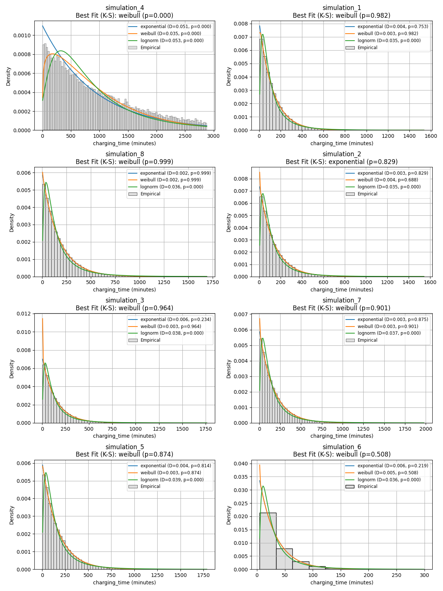
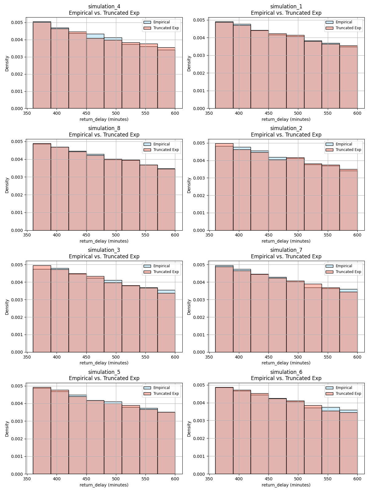

# ELECTRIC VEHICLE CHARGING FLEET STRATEGY MODELS OF DIFFERENT DELIVERY STRATEGIES

Author: Michael Einreinhof

# ABSTRACT

The transition to electric vehicles (EVs) presents significant challenges for fleet operations, particularly in routing and recharging logistics constrained by battery capacity, charging speed, and infrastructure availability. This study investigates how different charging strategies and infrastructure configurations affect system performance using a discrete-event simulation (DES) framework developed in SimPy. Parameters were derived from a preprocessed synthetic dataset of EV charging sessions, with arrival and service rates estimated via statistical analysis in R. The simulation models a fixed fleet of EVs operating under time-restricted work shifts, cycling between delivery tasks and charging events. Six main scenarios were tested, varying by charger type (Level 1, 2, and 3) and service rate assumptions, with additional runs exploring multi-server queueing configurations. Post-simulation metrics, including queue length, waiting time, and utilization, were analyzed using Erlang-C formulas to evaluate system responsiveness under M/M/c assumptions. Results indicate that slower chargers lead to excessive congestion and prolonged delays, while faster chargers significantly reduce queueing with minimal infrastructure. However, marginal returns diminish beyond a certain threshold of charger availability. The study highlights the importance of charger speed, capacity planning, and time-aware scheduling in achieving scalable and efficient EV fleet operations. Findings offer actionable insights for infrastructure designers, fleet managers, and urban planners tasked with supporting the accelerating EV transition.

# INTRODUCTION

## Rise of EVs and Recharging Challenges
The global transition to electric vehicles (EVs) is reshaping transportation and energy systems, spurred by environmental goals and supported by policy, infrastructure, and battery advances. Yet, this shift introduces routing and charging challenges—EVs have limited range, slower refueling (charging), and depend on an uneven charging infrastructure. These issues are especially acute for commercial fleets with tight delivery schedules, where charger availability and wait times directly impact operations.

## Problem Statement and Research Gap
Fleet routing for EVs must account for real-time State of Charge (SoC), delivery deadlines, and unpredictable charger access. Standard vehicle routing models fall short of capturing these dynamics, including queuing behavior and energy constraints. This research addresses that gap by integrating queueing theory and discrete-event simulation to study how recharging strategies influence charger demand and system performance.

## SoC-Aware Routing Models
Bac and Erdem (2021) introduced the EVRPTW-PR, incorporating partial charging, time windows, and heterogeneous fleets. Their model tracks SoC, recharge duration, and routing feasibility under real-world energy constraints. Jafari and Boyles (2017) approached the problem as a Markov Decision Process, optimizing single-EV decisions under stochastic, time-varying conditions. These works highlight the need for real-time SoC management and flexible charging decisions.

## Queueing Models at Chargers
Queueing models like M/M/1 and M/M/C are commonly used to simulate EV charging behavior. However, exponential service time assumptions often misrepresent real charging durations. Later models, such as Liu et al. (2021)'s M/D/C formulation, better capture real-world conditions by assuming deterministic charging times with stochastic arrivals, achieving improved accuracy in urban-scale simulations.

## Smart and Partial Charging
Uncontrolled charging risks grid instability and inefficiency. Smart charging, as categorized by Dahiwale et al. (2024), enables adaptive control using centralized or decentralized coordination. Reinforcement learning methods from Tuchnitz et al. (2021) have shown promise in reducing peak load and improving flexibility. Partial charging—emphasized by Bac and Erdem—offers operational benefits, reducing energy costs and improving schedule adherence.

## Algorithms for Charging-Aware Routing

Routing under SoC constraints has been approached through metaheuristics (variable neighbourhood search (VNS), variable neighbourhood descent (VND)), hybrid methods, and stochastic control. Bac and Erdem’s VNS/VND solution optimizes routes with partial recharge. Jafari and Boyles’ MDP-based routing adjusts to changing travel and queue conditions. Reinforcement learning models also show potential for routing integration, as shown by Tuchnitz et al. (2021).

## Discrete-Event Simulation with SimPy
SimPy is widely used for modeling EV operations due to its flexibility in handling asynchronous, time-driven events. Zhang and Varma (2024) developed a SimPy-based simulation to test ride-hailing EV strategies using real-world NYC data, demonstrating how EVs interact with chargers, trip requests, and dispatching under realistic conditions.

## Contribution of This Work
This study extends existing work by developing a SimPy-based simulation grounded in empirical data. Arrival and service rates are estimated using a cleaned Kaggle dataset in R, assuming Poisson arrivals and exponential charging durations. The simulation evaluates how different recharging strategies and charger configurations affect queue length, wait time, and system utilization. Post-simulation metrics are further analyzed using Erlang-C equations to support infrastructure planning.

# METHOD
## Data Preprocessing and Exploratory Analysis in RStudio
To support the design and parameterization of the simulation model, an initial dataset was obtained from Kaggle titled Electric Vehicle Charging Patterns (Electric Vehicle Charging Patterns, 2024). This dataset served as a proxy for electric vehicle (EV) charging behavior. According to its creators, the dataset was synthetically generated based on publicly available information, industry reports, and real-world charging station data. It was developed through data synthesis techniques incorporating diverse parameters such as vehicle specifications, user demographics, energy consumption profiles, and charging infrastructure characteristics. Statistical distributions and controlled variability were employed to reflect both common and edge-case charging behaviors across a geographically diverse set of urban and suburban charging environments.

All data processing and preliminary statistical analysis were conducted in RStudio (Version 2024.12.1+563) using the tidyverse, fitdistrplus, and lubridate libraries. Despite the dataset’s utility as a starting point, several inconsistencies and data quality issues were identified, necessitating extensive preprocessing to improve reliability and ensure alignment with the assumptions of the simulation model:

* Temporal Corrections: All charging sessions originally reported start times rounded to the nearest hour, which is unlikely in real-world conditions. Additionally, the reported end times often did not align with the provided durations. Charging start times were recalculated by subtracting the charging duration from the end time.
* State of Charge Corrections: Some entries indicated a decrease in the state of charge (SoC) during a session (end SoC lower than start SoC). These instances were corrected by inverting the the start SoC and end SoC values where appropriate. Charges exceeding 100% or beginning at or below 0% were excluded.
* Charger Type Discrepancies: All charger levels (Level 1, Level 2, DC Fast) showed nearly identical average charging rates, contrary to real-world expectations. This raised concerns about the data's realism, prompting further evaluation of charging efficiency distributions.

To improve dataset focus and reduce noise from geographical variability, only records from Los Angeles were retained. Results from

Feature Engineering

Several derived variables were computed to facilitate later simulation modeling:

* Charging Efficiency: Measured in kilowatts (kW), computed as the energy delivered per hour divided by charging time.
* Arrivals Times: Charging sessions were grouped by the hour of start time to estimate temporal patterns in user behavior.
* Interarrival Times: Time between successive vehicle arrivals was calculated per user type to enable queueing model parameter estimation.
* Categorical Encoding: User types and charger types were encoded as ordered factors to enable stratified analysis.
Verification, Validation, and Credibility Steps

Key queueing parameters were extracted from the cleaned dataset:

* Arrival Rate (λ): Mean number of charging events per hour was computed based on corrected start times.
* Service Rate (μ): Mean charging durations were calculated and inverted to obtain service rates. Rates were computed both overall and stratified by charger type.
* Utilization (ρ): System utilization was estimated as the ratio of λ to μ, providing a basis for evaluating congestion under M/M/1 queueing assumptions.
* Interarrival times were further modeled using distribution fitting via the fitdistrplus package. Candidate distributions (exponential, lognormal, Weibull) were compared using AIC values, and best fits were visualized using faceted histograms and scaled density overlays.

## Discrete-Event Simulation in SimPy
To model the dynamics of EV fleet behavior at charging stations, a discrete-event simulation (DES) framework was implemented using the SimPy library in Python. The simulation captures EV arrival, queueing, and charging behavior under realistic time constraints, using parameter estimates derived from the preprocessed Kaggle dataset.

### Simulation Overview

The model simulates a fixed fleet of 30 electric vehicles (EVs) over a period of 54 days, with each day comprising 24 hours. However, vehicles operate only during defined working hours: 7:00 AM to 9:00 PM. Each EV alternates between delivery trips and charging, looping over consecutive workdays.

The primary components of the simulation include:

* EV Process: Each EV performs a delivery (random exponential distribution duration between 6 to 10 hours, constrained to occur fully within the 7:00 AM to 9:00 PM work shift), returns to request a charger, waits in queue if necessary, charges for a service-time drawn from an exponential distribution, and then waits until the next workday.
* Charger Resource: Simulated as a simpy.Resource with limited capacity (1 charger per simulation scenario), where contention for access is modeled explicitly.
* Charger Attributes: Encapsulated in a dedicated class defining the average service rate (μ, in hours) and number of available chargers.
* Event Logging: All EV behaviors are logged to structured JSON files, capturing event timestamps, simulation day/hour, queue lengths, and charging durations. This data format will allow for easier post-processing of the logs collected.

### Model Parameters

Initial simulation parameters were derived from exploratory data analysis conducted in R.

* Arrival Rate (λ): Set at 10.375 arrivals per hour, calculated as the average hourly arrival rate across all users in Figure 1.
* Service Rates (μ): Estimated for each charger type using the inverse of the mean charging duration observed in the dataset from Figure 2:

    * Level 1: 2.12 hours
    * Level 2: 2.28 hours
    * Level 3 (DC Fast): 2.39 hours

* Simulation Duration: The model was run over 54 days, totaling 77,760 simulation minutes (54 days × 24 hours × 60 minutes).

|  | 
|:--:| 
| Figure 1 |

|  | 
|:--:| 
| Figure 2 |

To more accurately reflect real-world charging behavior, an additional set of service rates was introduced, based on the typical time required for each charger type to reach 80% charge. These values reflect usage patterns observed in both residential and commercial settings:

* Level 1 chargers are commonly found in residential or long-stay locations with low turnover.
* Level 2 and Level 3 chargers are prevalent in both residential complexes and high-demand public or commercial areas.

These alternative real-world-based (Bogna, 2022) service rates (μ) were defined as:

* Level 1: 20.0 hours
* Level 2: 2.85 hours
* Level 3 (DC Fast): 0.5 hours

To explore the effects of charger availability within an M/M/c queueing framework, additional simulations varied the number of servers (chargers) for Level 2 chargers from 1 to 4 and 8, testing infrastructure performance under increased capacity.

### Simulation Logic

Each EV executes a cyclical routine:

Delivery Period: Simulated via an exponential distribution truncated between 360 and 600 minutes (6–10 hours).
Charger Request: EVs return from delivery and attempt to acquire a charging resource. If the charger is unavailable, they wait in queue.
Charging Event: Charging duration is randomly drawn from an exponential distribution using the mean μ of the current charger type, constrained between 5 and 2880 minutes.
End-of-Day Transition: Once charging is complete, EVs wait until the next day’s work window resumes before initiating the next delivery.
Each simulation is executed for 20 independent runs per charger type, and log data is stored in the logs/ directory for later analysis. Verbose logging is optionally enabled to trace simulation state changes.

### Temporal Handling

Helper functions (hour(), minute(), day()) are used to convert simulation time (in minutes) into human-readable format, which supports log consistency and later analysis. A wait_until_next_day() function ensures EVs do not initiate deliveries outside of operational hours.

## Post-Simulation Analysis and Aggregation

To analyze and compare simulation output across multiple scenarios and replications, a post-processing pipeline was implemented using Python (Pandas, Seaborn, NumPy, SciPy, Matplotlib). The simulation logs generated from SimPy were stored in JSON format, with each file representing a single simulation run for a given charger type configuration.

### Log Loading and Structuring

All simulation logs were loaded from the output directory using a custom load_logs() function, which extracted relevant event metadata including timestamps, queue lengths, and charger interactions. Each event’s extra information (return delays, charging times) was unpacked and merged into the main DataFrame for analysis. The source_file identifier was retained to track which simulation run each log entry originated from.

### Scenario-Based Aggregation

Simulation runs were grouped by scenario (charger type), and data was averaged across all replications within each group. This enabled robust estimation of trends while smoothing individual run variability. Key analysis methods included:

* Histogram Visualization: Return delays and charging times were visualized using combined histograms and Kernel Density Estimate overlays across all runs per scenario.
* Distribution Fitting: Kolmogorov–Smirnov (K-S) tests were used to fit candidate distributions (exponential, Weibull, lognormal) to each variable. The best-fitting distribution was reported per scenario using D-statistics and p-values.
* Empirical vs Theoretical Comparison: Empirical return delays were compared to samples generated from a truncated exponential distribution (based on the λ value from real-world data) to assess modeling realism.
* Heatmaps of Activity: Hourly heatmaps by day and hour were constructed to visualize charger request patterns across time, helping to identify usage peaks and congestion trends.

### Performance Parameter Estimation

To support quantitative evaluation of system performance under M/M/1 assumptions, arrival and service rates were estimated per simulation run and then averaged across scenarios:

λ (Arrival Rate): Calculated from the mean return delay (in hours) as λ = 1 / mean_return_delay.
μ (Service Rate): Inferred from the mean charging duration (in hours) as μ = 1 / mean_charging_time.
ρ (Utilization): Computed as ρ = λ / μ, and averaged across runs.
All scenario-level summaries were compiled into a single CSV output for further inspection.

### Erlang-C Queueing Evaluation

Using the averaged λ and μ values, theoretical queueing performance was analyzed for charger systems with 1 to 4 servers using the Erlang-C formula. Metrics calculated included:

Probability of waiting
Expected queue waiting time (E[Wq])
Total expected waiting time (E[W])
System utilization
These results were saved in structured JSON format for each scenario and used to support discussion on charger sizing and queue mitigation strategies.

# RESULTS AND DISCUSSION

## Distribution Fitting for Charging Time and Return Delay

To model realistic EV behavior, empirical charging time and return delay distributions were analyzed across six simulation scenarios.

### Charging Time Distributions

As shown in Figure 3, most charging durations exhibited a right-skewed distribution. The Weibull distribution consistently emerged as the best-fitting model for charging times across multiple simulations (Sim_2, Sim_4, Sim_5, and Sim_6), with KS p-values above 0.8 in several cases. However, simulations such as Sim_1 and Sim_3 were better approximated by the exponential distribution (p > 0.7), suggesting some scenarios were well-modeled by memoryless service times.

|  | 
|:--:| 
| Figure 3 |

### Return Delay Distributions

For return delays, none of the standard theoretical distributions provided a fully accurate fit across all simulations. This limitation arises from the intentional truncation of the exponential distribution used to simulate EV return times. The truncation was necessary to reflect realistic work shift durations, which were constrained to a plausible window of approximately 6 to 10 hours. As a result, the return delays exhibit a shape that diverges from the heavy-tailed behavior of an unbounded exponential or lognormal process.

As shown in Figure 4, the truncated exponential approximation significantly underestimates peak return activity and fails to capture the tapering behavior at the upper end of the distribution. These deviations underscore the challenge of applying traditional continuous distributions to operationally constrained processes and highlight the need for custom or empirically-driven models when working within fixed time windows.

|  | 
|:--:| 
| Figure 4 |

## Charging Demand and Utilization Trends

Hourly heatmaps across all eight simulations reveal two key dynamics in fleet charging behavior: when EVs request chargers and when they actually begin charging.

The requesting charger heatmaps (Figure 5) show a consistent peak in demand between 13:00 and 15:00 across all scenarios. This congestion window aligns with vehicle return patterns during the late afternoon, indicating strong diurnal regularity in fleet operations. This temporal consistency persists even with changes to service rates and charger types, underscoring the importance of time-aware charging strategies and infrastructure planning to handle clustered demand.

In contrast, the starts charging heatmaps (Figure 6) provide insight into how effectively the system handles these requests. Simulations using slower chargers (Sim 4, Level 1) show dispersed start times throughout the workday, reflecting long service durations and slower throughput. Faster chargers (Sim 6, Level 3) enable more responsive handling of demand, with starts more concentrated near the request peak—indicating that vehicles are quickly serviced and cleared from the queue.

Simulations 7 and 8, configured with 4 and 8 chargers respectively, demonstrate highly responsive systems where peak demand is immediately absorbed, resulting in sharp vertical bands of charging starts around 13:00–14:00. These serve as high-capacity benchmarks and highlight how increased infrastructure can mitigate queuing delays altogether.

Together, these patterns emphasize the need for dynamic scheduling, capacity-aware infrastructure decisions, and potentially staggered return policies to reduce bottlenecks during critical periods.

|  | 
|:--:| 
| Figure 5 |

|  | 
|:--:| 
| Figure 6 |

## Erlang-C Performance Analysis

To evaluate how charger quantity and type influence system performance, Erlang-C metrics were calculated for Simulations 1 through 6 using charger counts (c in {1,2,3,4}). These metrics include the probability of wait, expected queueing time (E[W_q]), total time in the system (E[W]), and server utilization (ρ). Simulations 1 through 3, which used empirically derived charging rates from the Kaggle dataset (μ ≈ 0.405–0.451/hr), showed consistently low utilization (under 0.32) and rapidly diminishing wait probabilities as the number of chargers increased. Notably, in Simulation 1, (E[W_q]) dropped from 0.87 hours with one charger to just 0.0025 hours with three chargers. Total system time (E[W]) converged around 2.2–2.5 hours across all three scenarios when three or more chargers were provided.

Simulation 4, which modeled Level 1 chargers (μ ≈ 0.065/hr), exhibited the worst performance, representative of slower legacy or home-style charging units. At a single charger, utilization exceeded 1.94, signaling an overloaded system. Even at four chargers, the system remained unstable, with expected time in system (E[W]) still around 16.1 hours. Furthermore, numerical instabilities emerged in the Erlang-C outputs (negative queue times at (c=1)), indicating a breakdown in the model due to excessive demand.

In contrast, Simulation 5 simulated Level 2 chargers (μ ≈ 0.343/hr), which reflect common public charging infrastructure. Here, utilization dropped from 0.37 with one charger to just 0.09 with four. As a result, total time in system decreased from 4.62 hours to 2.91 hours, and queueing delay was nearly eliminated with just three chargers ((E[W_q] < 0.01) hours). Simulation 6, using Level 3 fast chargers (μ ≈ 1.7216/hr), performed best. Even at a single charger, utilization was very low (≈ 0.07), and total system time was modest at 0.63 hours. With two or more chargers, both wait probability and queueing delay became negligible.

Finally, Simulations 7 and 8 explored extended infrastructure provisioning by initializing with four and eight chargers, respectively (μ ≈ 0.341/hr). In Simulation 7, (E[W]) was already reduced to approximately 2.93 hours at four chargers with a utilization of just 0.093. Increasing to eight chargers further reduced the wait probability to around 6.6×10E-9, but offered negligible improvement in total time (≈2.925 hours), suggesting diminishing returns. Simulation 8 followed a similar trend, showing virtually zero queueing from six chargers onward, reaffirming the point of saturation in infrastructure scaling.

# CONCLUSION

This study examined the complex interplay between electric vehicle (EV) fleet operations and charging infrastructure using a discrete-event simulation framework grounded in real-world-inspired data. By integrating queueing theory, SimPy-based modeling, and empirical parameter estimation from a synthesized Kaggle dataset, the research explored how varying charger types, service rates, and charger quantities affect system performance across a range of scenarios.

The simulation findings confirm that recharging strategy and infrastructure design are pivotal to ensuring operational efficiency in EV fleets. Specifically, slow chargers like Level 1 create significant bottlenecks under realistic demand, even with increased capacity. In contrast, Level 2 and especially Level 3 (DC fast) chargers effectively reduce queueing delays and overall time in system, demonstrating their critical role in high-demand fleet environments. Erlang-C analyses revealed that small increments in infrastructure—particularly for mid-tier chargers—can sharply reduce queue times and increase system responsiveness. However, beyond a certain point, adding more chargers offers diminishing returns, emphasizing the importance of strategic sizing rather than brute-force expansion.

These results support the hypothesis that optimal fleet performance is contingent not just on charger availability, but on a nuanced understanding of charger speed, fleet behavior, and time-of-day dynamics. The hourly heatmaps and distribution fitting further demonstrate the need for time-aware infrastructure planning, highlighting consistent afternoon peaks in demand regardless of charger type.

From a broader societal perspective, these insights offer guidance for urban planners, utility providers, and fleet managers seeking to scale EV infrastructure without incurring excessive capital costs. Smart deployment of faster chargers in high-traffic zones, combined with adaptive scheduling policies and real-time queuing feedback, can significantly improve system throughput while maintaining user satisfaction and operational consistency.

Nonetheless, the study is subject to limitations. The simulation assumes exponential service times, which do not always align with real-world charging behavior, particularly under partial or smart charging protocols. Moreover, while the Kaggle dataset provided a useful proxy, its synthetic nature and lack of spatial granularity limit external validity. Future work should incorporate geographically distributed real-world data, spatial modeling of charger locations, and more sophisticated driver behavior models (choice-based queuing or routing). Additionally, expanding the simulation to include vehicle-to-grid (V2G) dynamics and dynamic pricing mechanisms could offer further insights into system-level optimization under energy grid constraints.

In summary, this work advances the state of EV fleet simulation by combining empirical data, rigorous queueing analysis, and scalable modeling techniques to assess how infrastructure and operational policies interact. These findings contribute to the growing toolkit for managing the EV transition and underscore the value of simulation in informing evidence-based transportation planning.

# CITATIONS

<a id="1">[1]</a> *A comprehensive review of smart charging strategies for electric vehicles and way forward.* (2024, September 1). IEEE Journals & Magazine | IEEE Xplore. https://ieeexplore.ieee.org/abstract/document/10457989 

<a id="2">[2]</a> Bac, U., & Erdem, M. (n.d.). Optimization of electric vehicle recharge schedule and routing problem with time windows and partial recharge: a comparative study for an urban logistics fleet. *Sustainable Cities and Society*, 70, 102883. https://doi.org/10.1016/j.scs.2021.102883 

<a id="3">[3]</a> Bogna, J. (2022, April 8). *Level 1, Level 2, or Level 3? EV Chargers explained.* How-To Geek. https://www.howtogeek.com/793471/ev-charger-levels-explained/ 

<a id="4">[4]</a> *Electric vehicle charging patterns.* (2024, October 2). Kaggle. https://www.kaggle.com/datasets/valakhorasani/electric-vehicle-charging-patterns 

<a id="5">[5]</a> Jafari, E., & Boyles, S. D. (2017). Online charging and routing of electric vehicles in stochastic Time-Varying networks. *Transportation Research Record Journal of the Transportation Research Board*, 2667(1), 61–70. https://doi.org/10.3141/2667-07 

<a id="6">[6]</a> Liu, B., Pantelidis, T. P., Tam, S., & Chow, J. Y. J. (2022). An electric vehicle charging station access equilibrium model with M/D/C queueing. *International Journal of Sustainable Transportation*, 17(3), 228–244. https://doi.org/10.1080/15568318.2022.2029633 

<a id="6">[6]</a> Tuchnitz, F., Ebell, N., Schlund, J., & Pruckner, M. (2021). Development and evaluation of a smart charging strategy for an electric vehicle fleet based on reinforcement learning. *Applied Energy, 285*, 116382. https://doi.org/10.1016/j.apenergy.2020.116382 

<a id="7">[7]</a> Zhang, C., & Varma, S. (2024, November 29). *A Simulation Framework for Ride-Hailing with Electric Vehicles.* arXiv.org. https://arxiv.org/abs/2411.19471

# AI Usage

ChatGPT was used to proofread, rubber duck, and help structure this paper.